# Graph Transformer: Case Study on Tox21 Dataset

# 1. Introduction

Transformers — a tremendous success in the field of natural language processing (NLP). They are currently the best-performing neural network architectures for handling long-term sequential data.

Transformers excel at processing sequential data, but can they achieve similar success with graph data? We will explore this idea in this article.

---

# 2. What is a Transformer?

Imagine you’re reading a sentence. Your understanding of each word relies not only on the word itself but also on the context provided by other words in the sentence. Transformers mimic this process by assigning weights to each word in a sequence, emphasizing the words that are most relevant for understanding the context of a given word.

Another powerful feature of Transformers is their ability to process all words in a sentence simultaneously rather than one at a time. This parallel processing allows Transformers to capture complex dependencies between words more efficiently, significantly speeding up training and inference compared to traditional sequential models.

In this article, we’ll delve into two main components of the Transformer architecture: **Attention** and **Positional Encoding**.
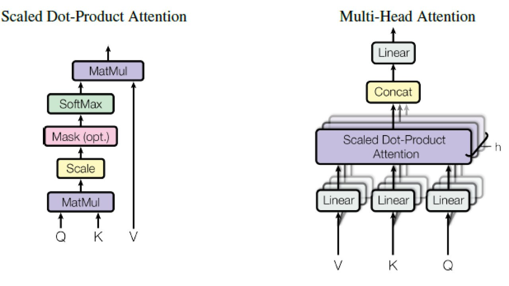

---

# 3. Attention Mechanism

The attention mechanism enables transformers to capture dependencies between words — how words in the sequence relate to other words in that sequence — addressing a key limitation of earlier architectures like RNNs, which struggle with long-range dependencies.

### Key, Query, Value in Attention

In the attention mechanism, each word in a sequence is represented by three vectors: **Key**, **Query**, and **Value**. These vectors help the model determine the relevance of words in the sequence to each other.

We can think of it like a search system:

- **Queries**: The search term you input.
- **Keys**: Metadata of the documents you have (e.g., document summaries).
- **Values**: The content of the documents.

Let’s say you’re searching for “pizza recipes”:
- **Query**: “Pizza recipes”
- **Keys**: Titles of various recipe pages, like “Classic Margherita,” “Tomatoes Salad,” “Smoked Salmon,” “Pepperoni Pizza,” etc.
- **Values**: The actual content of these recipe pages.

The attention mechanism scores each key based on its similarity to the query. For instance, “Classic Margherita” and “Pepperoni Pizza” will get the highest score. This similarity score determines how much focus to place on each value in the sequence.

---

### Attention Mechanism

```python
class Attention(nn.Module):
    """
    Compute 'Scaled Dot Product' Attention
    """
    def forward(self, query, key, value, mask=None, dropout=None):
        scores = torch.matmul(query, key.transpose(-2, -1)) \
                 / math.sqrt(query.size(-1))  # Scale by the square root of key dimension

        if mask is not None:
            scores = scores.masked_fill(mask == 0, -1e9)  # Apply mask for padding

        p_attn = F.softmax(scores, dim=-1)  # Compute attention weights

        if dropout is not None:
            p_attn = dropout(p_attn)  # Optional dropout for regularization

        return torch.matmul(p_attn, value), p_attn
```

### Code Explanation
- Dot Product: `torch.matmul(query, key.transpose(-2, -1))` computes the dot product $QK^T$.
- Scaling: Division by `math.sqrt(query.size(-1))` stabilizes the gradients by scaling scores.
- Masking: If a mask is provided, irrelevant positions (e.g., padding tokens) are assigned a score of $-\infty$, effectively ignoring them in softmax.
- Softmax: `F.softmax(scores, dim=-1)` normalizes the scores into probabilities.
- Weighted Sum: `torch.matmul(p_attn, value)` applies the weights to the Value vectors to produce the final attention output.

# 4. Mathematical Explanation

The attention mechanism is governed by the following formula:

$$
\text{Attention}(Q, K, V) = \text{Softmax}\left(\frac{QK^T}{\sqrt{d_k}}\right)V
$$

In this formula:
- **Query (Q)**, **Key (K)**, and **Value (V)** are matrices derived from the input data:
  - **Query (Q)**: Computed as $Q = XW_Q$.
  - **Key (K)**: Computed as $K = XW_K$.
  - **Value (V)**: Computed as $V = XW_V$.

The matrices $W_Q$, $W_K$, and $W_V$ are learnable parameters. These steps are implemented as follows:

---

## **Relevant Code: Query, Key, Value Projection**

The projections for $Q$, $K$, and $V$ are handled by the `MultiHeadedAttention` class:

```python
class MultiHeadedAttention(nn.Module):
    """
    Multi-head attention implementation.
    """
    def __init__(self, h, d_model, dropout=0.1, bias=False):
        super().__init__()
        assert d_model % h == 0

        self.d_k = d_model // h  # Dimension per head
        self.h = h  # Number of attention heads

        # Linear layers for query, key, and value projection
        self.linear_layers = nn.ModuleList([nn.Linear(d_model, d_model) for _ in range(3)])
        self.output_linear = nn.Linear(d_model, d_model, bias)
        self.attention = Attention()
        self.dropout = nn.Dropout(p=dropout)

    def forward(self, query, key, value, mask=None):
        """
        Project inputs (query, key, value) and apply attention.
        """
        batch_size = query.size(0)

        # Linear projections for query, key, value
        query, key, value = [
            layer(x).view(batch_size, -1, self.h, self.d_k).transpose(1, 2)
            for layer, x in zip(self.linear_layers, (query, key, value))
        ]

        # Apply attention
        x, attn = self.attention(query, key, value, mask=mask, dropout=self.dropout)

        # Concatenate heads and project the output
        x = x.transpose(1, 2).contiguous().view(batch_size, -1, self.h * self.d_k)
        return self.output_linear(x)
```
---

### **Explanation of the Code**
1. **Projections**:
   - $Q = XW_Q$, $K = XW_K$, $V = XW_V$: Performed by linear layers (`self.linear_layers`) applied to the input.
   - After projection, the results are reshaped to split across attention heads (`self.h`) and transposed for easier computation.
2. **Attention**:
   - The `Attention` module (defined previously) computes the attention scores and weighted values.
3. **Concatenation**:
   - The outputs from all heads are concatenated and projected back to the original model dimension using `self.output_linear`.

---

## **Steps in Attention Computation**

### 1. Dot Product
The dot product measures the similarity between the query and each key:

$$
\text{Attention Score} = QK^T
$$

The dot product between 2 vectors returns the angle between the vectors- such that the dot product between vectors with similar directions will be large, and with orthogonal vectors the dot product will be 0.

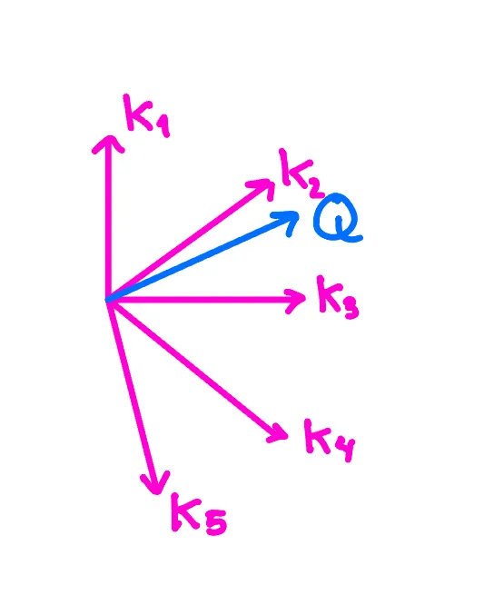


### **Code Reference: Scaled Dot-Product**
The dot product and scaling are implemented in the `Attention` class:

```python
class Attention(nn.Module):
    def forward(self, query, key, value, mask=None, dropout=None):
        scores = torch.matmul(query, key.transpose(-2, -1)) / math.sqrt(query.size(-1))
        if mask is not None:
            scores = scores.masked_fill(mask == 0, -1e9)
        p_attn = F.softmax(scores, dim=-1)
        if dropout is not None:
            p_attn = dropout(p_attn)
        return torch.matmul(p_attn, value), p_attn
```
Here:
- `torch.matmul(query, key.transpose(-2, -1))`: Computes $QK^T$.
- `/ math.sqrt(query.size(-1))`: Scales the result.

---

### 2. Scaling
Scaling by $\sqrt{d_k}$ stabilizes gradients and ensures that softmax operates in a well-behaved range. 

This is achieved in the above `Attention` implementation with:
```python
scores = torch.matmul(query, key.transpose(-2, -1)) / math.sqrt(query.size(-1))
```

---

### 3. Softmax
The softmax function normalizes attention scores into probabilities:

$$
\text{Weights} = \text{Softmax}\left(\frac{QK^T}{\sqrt{d_k}}\right)
$$

In the code:
```python
p_attn = F.softmax(scores, dim=-1)
```

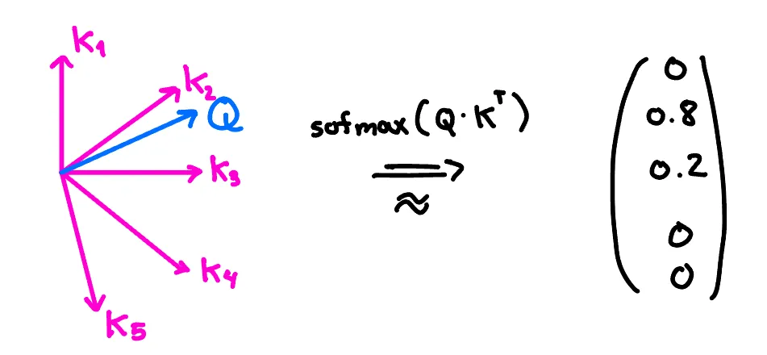

---

### 4. Weighted Sum
Finally, attention weights are applied to the Value matrix to compute the output:

$$
\text{Output} = \text{Weights} \cdot V
$$

In the `Attention` class:
```python
return torch.matmul(p_attn, value), p_attn
```

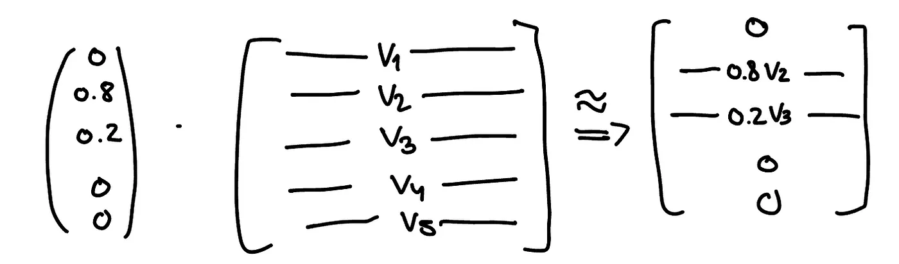

---

## **Quadratic Complexity**
The attention mechanism requires $n \times n$ interactions for a sequence of $n$ tokens, leading to quadratic complexity.

### **Supporting Code**
In the `MultiHeadedAttention` implementation:
```python
query, key, value = [
    layer(x).view(batch_size, -1, self.h, self.d_k).transpose(1, 2)
    for layer, x in zip(self.linear_layers, (query, key, value))
]
```
This ensures that all $n \times n$ interactions are computed efficiently in parallel.


# 5. Positional Encoding

In natural language processing (NLP), understanding the order of words is crucial. For example, if a word appears twice in a sequence, it doesn’t necessarily have the same semantic meaning each time. Traditional RNNs and LSTMs inherently handle this through their sequential nature, but Transformers, which process words in parallel, require an additional method to capture positional information. This is where positional encoding comes into play.

Positional encoding adds a unique vector to each word embedding based on its position in the sentence. These vectors ensure that the model can differentiate between sentences like “dog bites man” and “man bites dog,” even though the individual word embeddings might be similar.

Transformers use trigonometric functions to encode the position of a word in the sequence, creating continuous binary encodings. By adding these unique vectors to each word embedding based on its position in the sequence, the model can understand the relative distances between words, even in long sequences.

The encoding for each position is a combination of sine and cosine functions of varying frequencies:

$$
PE_{(pos, 2i)} = \sin\left(\frac{pos}{10000^{\frac{2i}{d_{model}}}}\right)
$$
$$
PE_{(pos, 2i+1)} = \cos\left(\frac{pos}{10000^{\frac{2i}{d_{model}}}}\right)
$$

This helps the model understand the relative distances between words, even in long sequences.

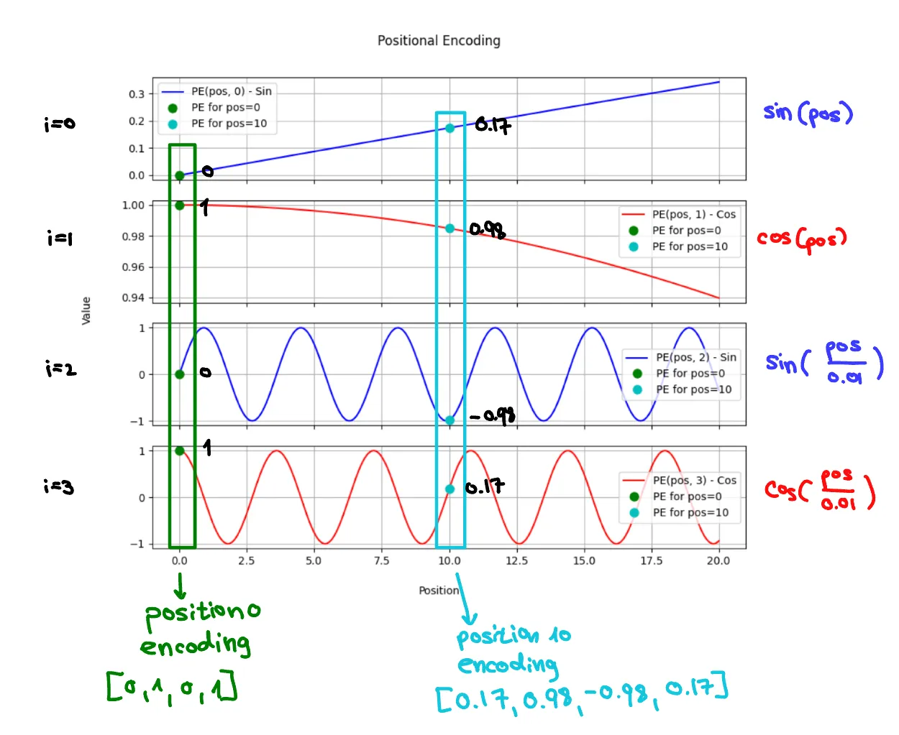

---

### **Relevant Code: Positional Encoding**

The positional encoding logic can be directly referenced in the following snippet:

```python
class PositionwiseFeedForward(nn.Module):
    """
    Implements FFN equation (Feed Forward Network used after attention layers)
    """
    def __init__(self, d_model, d_ff, activation="PReLU", dropout=0.1, d_out=None):
        super(PositionwiseFeedForward, self).__init__()
        if d_out is None:
            d_out = d_model
        self.W_1 = nn.Linear(d_model, d_ff)  # First transformation
        self.W_2 = nn.Linear(d_ff, d_out)  # Output transformation
        self.dropout = nn.Dropout(dropout)
        self.act_func = get_activation_function(activation)

    def forward(self, x):
        """
        Applies the feed-forward transformation.
        :param x: Input tensor.
        :return: Transformed tensor.
        """
        return self.W_2(self.dropout(self.act_func(self.W_1(x))))
```

---

### **Explanation of Code**

Although the positional encoding isn't explicitly implemented here as sine/cosine functions, the feed-forward network processes these embeddings as input. Positional embeddings are typically pre-computed and added to input embeddings before the first layer of the Transformer model.

1. **Continuous Binary Encoding**:
   - $\sin$ and $\cos$ functions encode the position of words in a sequence with continuous values.
   - For even indices ($2i$), the sine function is used, while for odd indices ($2i+1$), the cosine function is used.
   - These functions allow the model to distinguish positional information using a range of frequencies.

2. **Frequency Impact**:
   - **Low Frequencies**: Capture long-range relationships by encoding global structural information.
   - **High Frequencies**: Capture short-range relationships, useful for encoding local context (e.g., adjacent words).

3. **Model Processing**:
   - After positional encoding vectors are added to the word embeddings, the `PositionwiseFeedForward` module processes the result, applying transformations via learned weights $W_1$ and $W_2$.

---

### **Multi-Scale Understanding of Sequence Structure**

Positional encoding ensures that the Transformer can understand both local and global positional relationships, enabling it to model dependencies over long distances while preserving short-range information. This multi-scale approach is essential for tasks where understanding sentence structure and word ordering is critical.


# 6. Graph Neural Networks

Graphs are a powerful tool for modeling complex relationships and interactions within data. They allow us to represent entities as nodes and their interactions as edges, making them invaluable for a wide range of applications. For instance:
- In social networks, nodes represent individuals, and edges represent their connections.
- In transportation systems, nodes are locations, and edges are pathways.

Graph Neural Networks (GNNs) have emerged as a revolutionary approach to harness this potential. By leveraging the intricate structure of graphs, GNNs capture both local and global dependencies, offering a robust framework for various data-driven tasks. These include:
- **Node classification**
- **Graph regression**
- **Graph classification**

### Key Components of GNNs
1. **Node Features**: Each node in the graph has associated features that provide contextual information.
2. **Edge Features**: Edges can also have features that describe the nature of the relationships between nodes.

The ability of GNNs to process and analyze graph-structured data opens up numerous possibilities. They have been successfully applied in various fields:
- **Biology**: Predicting protein-protein interactions.
- **Chemistry**: Molecular property prediction.
- **Recommendation Systems**: Suggesting products or content.

---

# 7. Graph Transformer

Transformers have revolutionized the handling of sequential data, prompting the question: can they also excel with graph data? This transition from sequential to graph data necessitates certain modifications to the transformer architecture. Let’s explore these adjustments and introduce Graph Transformers.

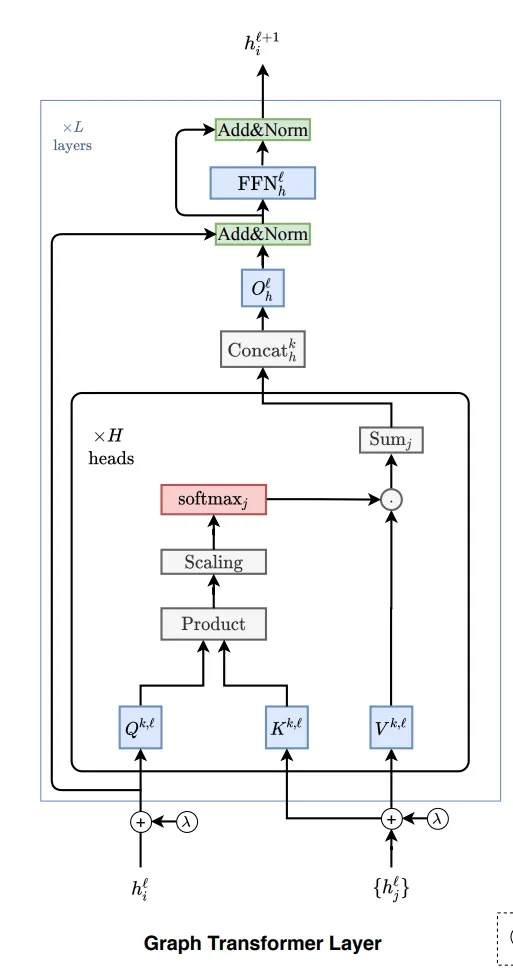

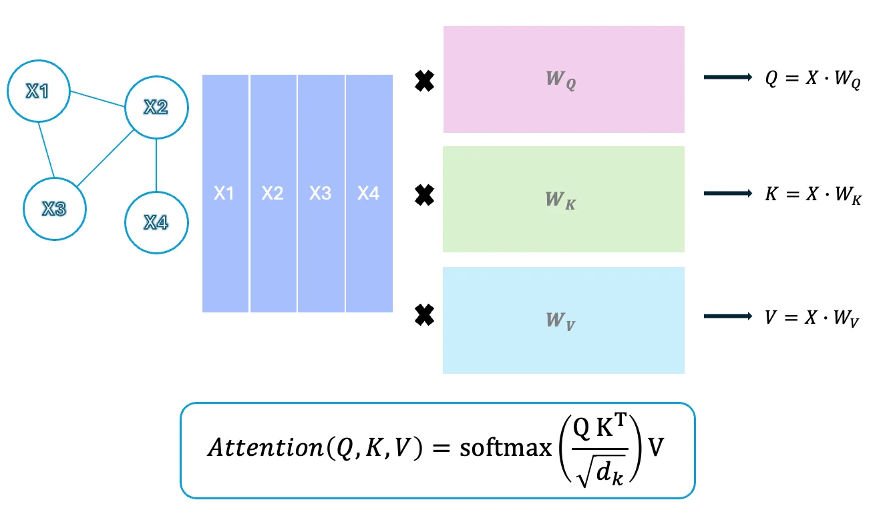

### Graph Transformer Architecture Overview
The architecture of a Graph Transformer includes the following components:

1. **Input Graph**: The model takes an input graph with nodes $\{x_1, x_2, x_3, x_4\}$ and edges representing the relationships between nodes.

2. **Node Features**: Each node $x_i$ in the graph is initially represented by a feature vector $X = [x_1, x_2, x_3, x_4]$.

3. **Linear Transformations**:
   - The node feature matrix $X$ is multiplied by three learned weight matrices $W_Q$, $W_K$, $W_V$ to produce the **Query (Q)**, **Key (K)**, and **Value (V)** matrices.

4. **Positional Encoding**:
   - Unlike NLP Transformers, where positional encodings capture the position of words in a sequence, **Graph Transformers use positional encodings to capture the structural information of the graph**, providing context about the node’s position within the graph.

5. **Attention Calculation**: The attention scores are computed using the standard attention formula:
   $$
   \text{Attention}(Q, K, V) = \text{Softmax}\left(\frac{QK^T}{\sqrt{d_k}}\right)V
   $$

6. **Output**: The final node representations can be used for various downstream tasks, such as:
   - **Node classification**
   - **Graph classification**
   - **Graph regression**

---

### **Relevant Code: Node and Edge Attention with Graph Transformers**

The `GTransEncoder` class demonstrates how attention is applied to graph data, with nodes and edges treated as inputs:

```python
class GTransEncoder(nn.Module):
    def __init__(self, args, hidden_size, edge_fdim, node_fdim, dropout=0.0, activation="ReLU", num_mt_block=1, 
                 num_attn_head=4, atom_emb_output=False, bias=False, cuda=True, res_connection=False):
        super(GTransEncoder, self).__init__()

        self.hidden_size = hidden_size
        self.edge_blocks = nn.ModuleList()
        self.node_blocks = nn.ModuleList()

        # Define multi-head attention blocks for both edges and nodes
        for i in range(num_mt_block):
            self.edge_blocks.append(MTBlock(args, num_attn_head, edge_fdim, hidden_size, activation, dropout, bias, cuda))
            self.node_blocks.append(MTBlock(args, num_attn_head, node_fdim, hidden_size, activation, dropout, bias, cuda))

    def forward(self, batch):
        # Unpack the batch
        f_atoms, f_bonds, a2b, b2a, b2revb, a_scope, b_scope, a2a = batch

        # Process node features through node blocks (attention layers)
        for nb in self.node_blocks:
            batch, _ = nb(batch)

        # Process edge features through edge blocks
        for eb in self.edge_blocks:
            batch, _ = eb(batch)

        return batch
```

---

### **Explanation of the Code**
1. **Graph as Input**:
   - Node features (`f_atoms`) and edge features (`f_bonds`) are processed through separate multi-head attention blocks.
   - The attention mechanism is applied both locally (to neighbors) and globally (to all nodes/edges).

2. **Multi-Head Attention for Graphs**:
   - Attention is applied through `MTBlock`, which computes attention over the graph structure.
   - Nodes attend to their neighbors via adjacency lists (`a2b`, `b2a`), while edges attend to surrounding nodes.

3. **Integration of Structural Information**:
   - Positional encodings are not explicitly shown in this code, but the adjacency information (`a2a`, `b2revb`) inherently encodes the graph's structural relationships.

---

### **Graph Transformers in Action**
By combining the attention mechanism with graph-structured data:
- **Graph Transformers** adapt the powerful Transformer architecture to the unique structure of graphs.
- Unlike sequential Transformers, Graph Transformers handle structural information natively, leveraging adjacency and edge/node-specific relationships.


### MTBlock: Multi-Head Attention for Graph Data

The **`MTBlock`** (Multi-Head Transformer Block) is a core component of the Graph Transformer architecture. It applies the multi-head attention mechanism over graph data, processing both **nodes** and **edges**.

---

### **Relevant Code: MTBlock**

The `MTBlock` class processes the input graph data using multi-head attention and additional transformations:

```python
class MTBlock(nn.Module):
    """
    Multi-Head Attention Block for Graph Transformers
    """

    def __init__(self, args, num_attn_head, input_dim, hidden_size, activation="ReLU", dropout=0.0, bias=True, 
                 atom_messages=False, cuda=True, res_connection=False):
        super(MTBlock, self).__init__()

        self.atom_messages = atom_messages
        self.hidden_size = hidden_size
        self.res_connection = res_connection
        self.act_func = get_activation_function(activation)
        self.dropout_layer = nn.Dropout(p=dropout)
        self.layernorm = nn.LayerNorm(self.hidden_size, elementwise_affine=True)

        # Linear transformations for input
        self.W_i = nn.Linear(input_dim, self.hidden_size, bias=bias)
        
        # Multi-head attention layer
        self.attn = MultiHeadedAttention(h=num_attn_head, d_model=self.hidden_size, bias=bias, dropout=dropout)

        # Output transformation
        self.W_o = nn.Linear(self.hidden_size * num_attn_head, self.hidden_size, bias=bias)

        # Sublayer connection for residual connection
        self.sublayer = SublayerConnection(self.hidden_size, dropout)

    def forward(self, batch, features_batch=None):
        """
        Applies multi-head attention and transformations.
        :param batch: Graph data (nodes, edges, adjacency relationships).
        :param features_batch: Additional features for processing (deprecated).
        """
        # Unpack graph components
        f_atoms, f_bonds, a2b, b2a, b2revb, a_scope, b_scope, a2a = batch

        # Apply linear transformation to node or edge features
        if self.atom_messages:
            f_atoms = self.W_i(f_atoms)
            f_atoms = self.dropout_layer(self.layernorm(self.act_func(f_atoms)))
        else:
            f_bonds = self.W_i(f_bonds)
            f_bonds = self.dropout_layer(self.layernorm(self.act_func(f_bonds)))

        # Perform multi-head attention
        queries, keys, values = [], [], []
        for _ in range(self.attn.h):
            q, k, v = self.attn(f_atoms, f_bonds, a2b, a2a, b2a, b2revb)
            queries.append(q.unsqueeze(1))
            keys.append(k.unsqueeze(1))
            values.append(v.unsqueeze(1))

        queries = torch.cat(queries, dim=1)
        keys = torch.cat(keys, dim=1)
        values = torch.cat(values, dim=1)

        x_out = self.attn(queries, keys, values)  # Multi-headed attention
        x_out = x_out.view(x_out.shape[0], -1)
        x_out = self.W_o(x_out)

        # Optional residual connection
        x_in = f_atoms if self.atom_messages else f_bonds
        if self.res_connection:
            x_out = self.sublayer(x_in, x_out)

        # Update node or edge embeddings
        if self.atom_messages:
            f_atoms = x_out
        else:
            f_bonds = x_out

        return (f_atoms, f_bonds, a2b, b2a, b2revb, a_scope, b_scope, a2a), features_batch
```

---

### **Explanation of the Code**

1. **Input Transformation**:
   - The input features (either **nodes** or **edges**) are transformed using a linear layer $W_i$ and normalized using **LayerNorm** to prepare them for attention.
   - This ensures compatibility with the hidden size of the model.

2. **Multi-Head Attention**:
   - **Queries**, **Keys**, and **Values** are computed from the input graph data. These components are processed using the `MultiHeadedAttention` module to capture relationships between nodes or edges in the graph.

3. **Output Transformation**:
   - The outputs from the attention mechanism are concatenated and passed through a linear transformation $W_o$ to generate the final embeddings.

4. **Residual Connection**:
   - If enabled, the residual connection adds the input features back to the transformed output for better gradient flow and representation learning.

5. **Node or Edge Focus**:
   - The `atom_messages` flag determines whether the block processes **nodes** (atom-level embeddings) or **edges** (bond-level embeddings).

---

### **How MTBlock Fits into the Graph Transformer**

- The `MTBlock` applies **multi-head attention** to graph data, processing nodes and edges in separate layers.
- By stacking multiple `MTBlock` layers in the `GTransEncoder`, the model captures complex relationships between nodes and edges across multiple levels of abstraction.

---

# 8. Positional Encoding of Nodes Using Laplacian Eigenvectors

While many components remain similar, **positional encoding** requires adaptation for graphs. In graph neural networks (GNNs), positional encoding of nodes is essential for capturing the graph’s structure. **Spectral graph theory** offers a powerful method for this by using the eigenvectors of the Laplacian matrix.

---

### **What are Laplacian Eigenvectors?**

The **Laplacian matrix (L)** is significant as it encodes the graph’s structure. It is defined as:

$$
L = D - A
$$

where:
- $D$ is the **degree matrix** (a diagonal matrix with node degrees).
- $A$ is the **adjacency matrix** of the graph.

The Laplacian matrix is **positive semi-definite**, meaning all its eigenvalues are non-negative ($\lambda \geq 0$). The eigenvectors of $L$ satisfy the equation:

$$
L u = \lambda u
$$

where:
- $u$ is an eigenvector of $L$.
- $\lambda$ is the corresponding eigenvalue.

These eigenvalues and eigenvectors reveal key structural properties of the graph.


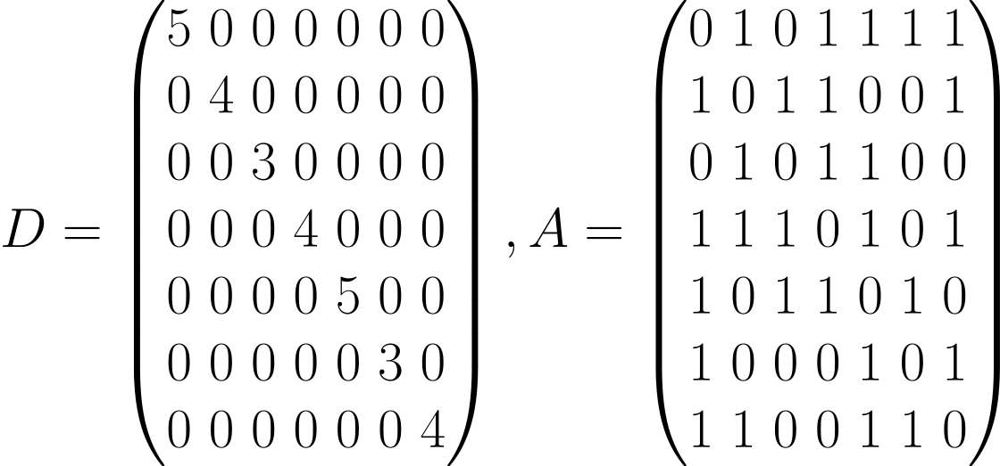
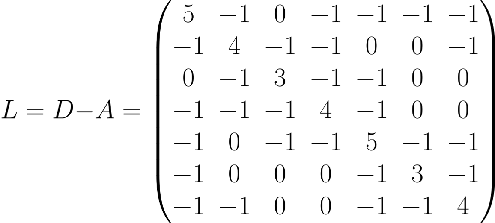

---

### Intuition Behind Using Laplacian Eigenvectors

#### Frequencies in a Graph

Think of eigenvectors of the Laplacian matrix as frequency modes on the graph. If you’ve encountered Fourier analysis, you know how sine and cosine waves represent different frequencies in continuous signals. Similarly, eigenvectors of $L$ represent frequency components for discrete signals on the graph.

- **Low-Frequency Modes**: The eigenvectors associated with the smallest eigenvalues of $L$ vary smoothly across the graph. Imagine a graph with two connected clusters — low-frequency eigenvectors will have similar values within each cluster, highlighting global relationships.
- **High-Frequency Modes**: Eigenvectors associated with larger eigenvalues oscillate rapidly, capturing finer, more localized details of the graph.

#### Why Does This Matter?

Graphs often represent data with both **local** (neighborhood) and **global** (overall structure) relationships. For example:
- In a social network graph, local relationships capture connections between friends, while global relationships capture community structures.
- In molecular graphs, local relationships detail chemical bonds, while global structures define molecular properties.

Laplacian eigenvectors provide a **multi-scale representation** of the graph, from broad structures (low-frequency) to fine-grained details (high-frequency). This property makes them crucial for tasks like clustering, node embedding, and graph neural networks (GNNs).

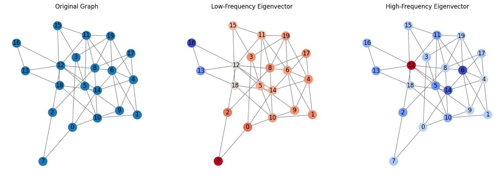

---

### Comparison to Positional Encoding in NLP

Graphs may seem unrelated to sequences in NLP (like sentences or time-series data), but they share a surprising conceptual similarity when it comes to encoding positional information.

#### Sine and Cosine Positional Encoding in NLP

In NLP, positional encoding ensures that models like Transformers understand the order of tokens in a sequence. The encoding is often done using sine and cosine functions. These functions provide a **continuous, periodic representation** of position that is globally smooth and fixed across all sequences.

#### Laplacian Eigenvector Positional Encoding

In contrast, graphs do not have a natural "order" like sequences. Instead, their structure is defined by the connections between nodes. This irregularity makes positional encoding more challenging.

Laplacian eigenvectors solve this by providing a positional encoding tailored to the graph’s topology. Low-frequency eigenvectors give smooth, global encoding across the graph, analogous to sine and cosine functions. High-frequency eigenvectors adaptively capture local details based on the graph's structure.

---

### A Surprising Connection: Graphs as Sequences

If we take a sentence (or sequence) and represent it as a **graph** where:
- Each word is a node.
- Each word is connected to the next (forming a line graph).

Then the **Laplacian eigenvectors** of this graph will encode positions in the same way as sine and cosine positional encoding. This connection bridges the gap between graph theory and NLP, showing that both frameworks aim to encode structural relationships—whether between tokens in a sequence or nodes in a graph.

For more details you can watch "Recipe for a General, Powerful, Scalable Graph Transformer": https://www.youtube.com/watch?v=DiLSCReBaTg&t=440s

---

### **Relevant Code: Laplacian Eigenvector Encoding**

The computation of Laplacian eigenvectors for positional encoding can be illustrated as follows:

```python
import torch
import scipy.sparse as sp
from scipy.sparse.linalg import eigsh

def compute_laplacian_eigenvectors(adj_matrix, num_eigenvectors=10):
    """
    Compute the Laplacian eigenvectors for a graph.
    :param adj_matrix: Sparse adjacency matrix of the graph (scipy.sparse format).
    :param num_eigenvectors: Number of eigenvectors to compute.
    :return: Eigenvectors of the Laplacian matrix.
    """
    # Compute degree matrix
    degree_matrix = sp.diags(adj_matrix.sum(axis=1).A1)

    # Compute Laplacian matrix
    laplacian = degree_matrix - adj_matrix

    # Compute eigenvectors and eigenvalues
    eigvals, eigvecs = eigsh(laplacian, k=num_eigenvectors, which="SM")  # Smallest eigenvalues

    return torch.tensor(eigvecs, dtype=torch.float32)
```

---

### **Explanation of the Code**

1. **Adjacency and Degree Matrices**:
   - The adjacency matrix ($A$) encodes connections between nodes.
   - The degree matrix ($D$) is computed as the sum of adjacency weights for each node.

2. **Laplacian Matrix**:
   - The Laplacian matrix is computed as $L = D - A$.

3. **Eigenvalue Decomposition**:
   - The smallest eigenvalues and their corresponding eigenvectors are computed using `eigsh`, capturing low-frequency (global) structural components of the graph.

4. **Result**:
   - The eigenvectors are returned as positional encodings for nodes. These encodings are used as additional features for nodes in the Graph Transformer.

---

### **How Graph Transformers Use Laplacian Eigenvectors**

Graph Transformers leverage Laplacian eigenvectors as **positional encodings**:
- Each node is assigned a vector encoding its position within the graph structure.
- These encodings provide critical structural information, complementing the multi-head attention mechanism applied in the `MTBlock`.

### Example Usage in the Graph Transformer:

```python
class GTransEncoder(nn.Module):
    def __init__(self, ... , use_positional_encodings=True, num_eigenvectors=10):
        super(GTransEncoder, self).__init__()
        self.use_positional_encodings = use_positional_encodings
        self.num_eigenvectors = num_eigenvectors

    def forward(self, batch):
        f_atoms, f_bonds, a2b, b2a, b2revb, a_scope, b_scope, a2a = batch

        if self.use_positional_encodings:
            laplacian_eigenvectors = compute_laplacian_eigenvectors(adjacency_matrix, self.num_eigenvectors)
            f_atoms = torch.cat((f_atoms, laplacian_eigenvectors), dim=1)  # Augment node features with eigenvectors

        # Proceed with attention layers (MTBlock)
        ...
```
---

### **Benefits of Laplacian Eigenvector Encoding**

1. **Captures Graph Structure**:
   - Encodes both **global** (smooth, low-frequency components) and **local** (sharp, high-frequency components) relationships.

2. **Rich Positional Representation**:
   - Provides multi-scale information about the position of each node within the graph.

3. **Enhances Graph Transformer Performance**:
   - Enables the attention mechanism to consider both structural and feature-based relationships.

Understanding Laplacian eigenvectors goes beyond technical definitions — they provide a lens for exploring **how information flows through a graph**. At their core, these eigenvectors allow us to break down complex graph structures into interpretable "building blocks."

### Interpreting Eigenvalues and Eigenvectors

Let’s revisit the Laplacian matrix $L=D−AL = D - A$, where $D$ is the degree matrix and $A$ is the adjacency matrix:

- **Eigenvalues**: Represent the "energy" required to transition between connected nodes.
- **Eigenvectors**: Define the "directions" or "patterns" of this energy transition.

Let’s visualize eigenvector patterns on a simple graph.

### Example: Ring Graph

Consider a circular graph with 10 nodes:

- The first eigenvector (associated with the smallest eigenvalue) assigns nearly equal values to all nodes, representing a global structure.
- Higher eigenvectors alternate more frequently, resembling sinusoidal waves wrapping around the graph.

Here’s the Python code for generating such visualizations:
```python
import networkx as nx
import numpy as np
import matplotlib.pyplot as plt

# Create a circular graph
G = nx.cycle_graph(10)

# Compute the Laplacian and its eigenvectors
L = nx.laplacian_matrix(G).toarray()
eigenvalues, eigenvectors = np.linalg.eigh(L)

# Plot the graph and eigenvectors side by side
fig, ax = plt.subplots(1, 2, figsize=(14, 6))

# Plot the graph
pos = nx.circular_layout(G)  # Position nodes in a circle
nx.draw(G, pos, with_labels=True, node_color='lightblue', edge_color='gray', ax=ax[0])
ax[0].set_title("Ring Graph")

# Plot eigenvectors
for i in range(4):  # Plot the first 4 eigenvectors
    ax[1].plot(eigenvectors[:, i], label=f'Eigenvector {i+1}')
ax[1].set_title("Laplacian Eigenvectors of a Ring Graph")
ax[1].set_xlabel("Node Index")
ax[1].set_ylabel("Eigenvector Value")
ax[1].legend()

plt.tight_layout()
plt.show()
```

**Output:**
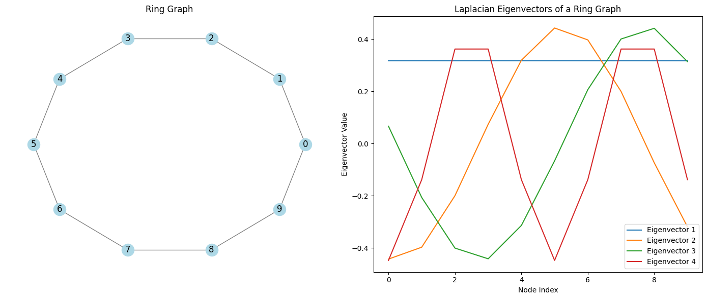

---

### Real-World Analogy to Laplacian Eigenvectors

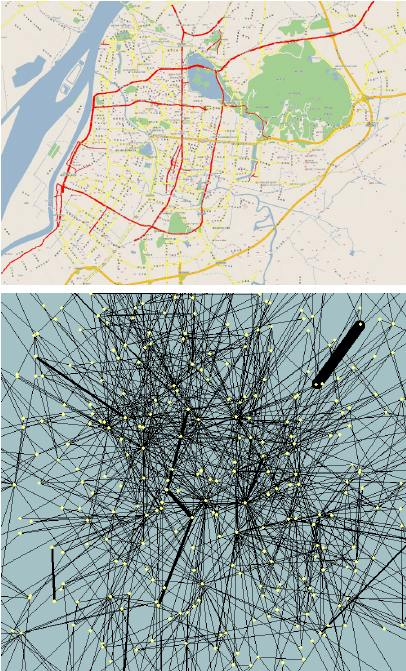

Imagine analyzing a city map:
- Low-frequency eigenvectors represent broad zones (residential, commercial, industrial).
- High-frequency eigenvectors detail specific streets and intersections.

Both perspectives are critical for understanding the city's layout, just as they are for graphs in computational tasks.

---

### Are there any other ways of positional encoding?

While Laplacian eigenvectors are a powerful tool, they aren’t the only way to encode positional information in graphs. Let’s compare and contrast with other methods.

#### Graph Wavelet Transform

Wavelets provide a multi-resolution view of a graph, similar to eigenvectors, but they are **localized** in both the graph and spectral domains. This property makes wavelets particularly useful for capturing local variations without losing sight of global structures.

#### Key Differences

|**Feature**|**Laplacian Eigenvectors**|**Graph Wavelets**|
|---|---|---|
|Basis Type|Global|Localized|
|Smoothness vs. Detail|Balances both via eigenvalues|Adapts to specific graph regions|
|Use Case|Clustering, community detection|Node classification, signal denoising|

You can read more about graph waveletes here: https://arxiv.org/abs/0912.3848

---

## Discussion: Challenges and Solutions in Scaling Graph Transformers

### 1. Attention Complexity: $O(n^2)$

The **self-attention mechanism**, central to the Transformer architecture, computes pairwise attention scores for every combination of nodes. For a graph with $n$ nodes, this results in $O(n^2)$ complexity. While feasible for small graphs, this becomes prohibitive for larger graphs with thousands or millions of nodes. 

#### Why is this a problem?
In large graphs, the quadratic growth in computations leads to:
- **Excessive memory usage**: Each pairwise computation requires storage of intermediate values.
- **Slower processing**: Training and inference times become impractical as graph sizes increase.

---

### Suggested Solution: Local Neighborhood Attention

A promising solution is to localize the attention mechanism, restricting computations to a node’s **immediate neighbors** rather than all nodes in the graph.

---

#### Local Neighborhood Attention in Graph Attention Networks (GATs)

The **Graph Attention Network (GAT)** is a pioneering architecture that incorporates attention in a scalable way. Here’s how it works:

##### Mechanism
- **Sparse Attention**: Instead of computing attention scores for all pairs of nodes, GATs only compute scores for a node and its **direct neighbors** (nodes connected by an edge).
- **Feature Aggregation**: Each node aggregates information from its neighbors, weighted by the attention scores. Mathematically:

$$
h_i' = \sigma \left( \sum_{j \in \mathcal{N}(i)} \alpha_{ij} W h_j \right)
$$

  - $h_i'$: Updated feature for node $i$
  - $\mathcal{N}(i)$: Set of neighbors for node $i$
  - $\alpha_{ij}$: Attention weight between node $i$ and $j$
  - $W$: Learnable weight matrix
  - $\sigma$: Activation function

##### Efficiency
- **Computational Complexity**: The localized approach reduces complexity from $O(n^2)$ to $O(n|E|)$, where $|E|$ is the number of edges. This is much more practical for sparse graphs where $|E| \ll n^2$.
- **Focus on Relevant Connections**: By attending only to immediate neighbors, the model concentrates on the most relevant parts of the graph.

---

**Illustration of Local Neighborhood Attention in GATs:**


Imagine a social network graph:
- For a person (node), the GAT only attends to their immediate friends (neighbors), ignoring distant connections.
- Each connection’s importance (attention weight) is learned during training, highlighting the most influential relationships.

---
### 2. Eigenvector Computation for Large Matrices

#### The Problem

Laplacian eigenvectors are a critical component of positional encoding in Graph Transformers, capturing multi-scale structural information about the graph. However, computing the eigenvectors for large graphs is computationally expensive and memory-intensive.

#### Why is Computing Eigenvectors Hard?

1. **Complexity**: The computational cost of eigenvector computation is $O(n^3)$ for a graph with $n$ nodes, which is infeasible for very large graphs.
2. **Memory Constraints**: Large matrices require significant memory, often exceeding the capacity of standard computational resources.

#### Current Approaches to Eigenvector Computation

#### Small Graphs
For small graphs, libraries like **NumPy** use efficient algorithms such as the **QR algorithm** or **Divide-and-Conquer methods** to compute eigenvectors. These methods solve the characteristic equation $Av = \lambda v$, where $A$ is the matrix, $\lambda$ is an eigenvalue, and $v$ is the corresponding eigenvector.

#### Large Graphs
For large graphs, approximate methods are more practical. These include:
- **Truncated Eigen Decomposition**: Computes only the top $k$ eigenvectors using iterative methods like **Lanczos algorithm** or **Power iteration**.
- **Graph Sampling**: Divides the graph into smaller subgraphs and computes eigenvectors locally.
- **Spectral Embedding Approximations**: Leverages methods like random projections or sparse approximations to estimate eigenvectors.

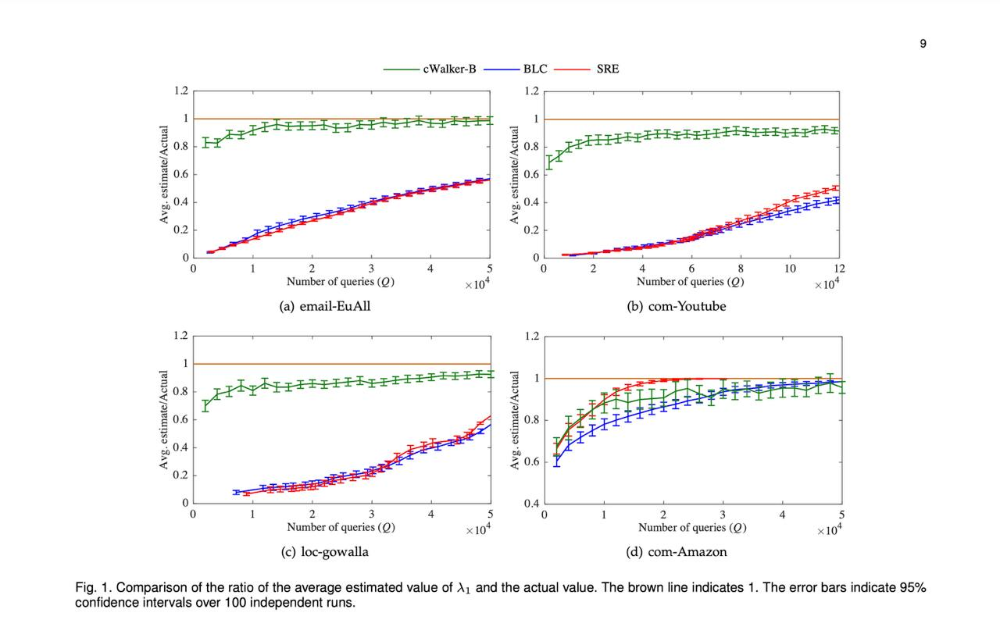
**Closed Walk Sampler: An Efficient Method for Estimating Eigenvalues of Large Graphs. Source: [arXiv:1805.07448](https://arxiv.org/pdf/1805.07448)**

---

### 3. Scaling to Massive Graphs: Innovations in Architecture

Graph Transformers face inherent limitations when processing massive graphs (e.g., with millions of nodes). Recent research has introduced **novel architectures** that address these scalability issues.

#### NAGphormer and VCR-Graphormer

#### The Approach
Both **NAGphormer** and **VCR-Graphormer** address scalability by breaking down the graph into manageable subgraphs:
- Each node’s neighborhood is represented as a **sequence**, capturing local structural information.
- These sequences are processed by a **Transformer** to model dependencies within the localized context.

#### Advantages
- **Localized Attention**: Focuses on smaller, relevant subgraphs, reducing the computational burden.
- **Scalability**: Handles massive graphs efficiently by avoiding the need to process the entire graph at once.
- **Preservation of Local Structure**: Encodes important local features while still allowing aggregation of global information over multiple layers.


Subgraph Decomposition and Processing Pipeline in NAGphormer and VCR-Graphormer.
Source: [arXiv:2403.16030](https://arxiv.org/abs/2403.16030)


#### Limitations
These approaches, while promising, may lose some global context if the subgraphs are too small or disconnected. To counter this, researchers are exploring hierarchical models that combine local and global information more effectively.

---

### The Role of Active Research

Both NAGphormer and VCR-Graphormer are part of a rapidly evolving field. With one published in 2023 and the other just months ago, they represent cutting-edge solutions to long-standing challenges in graph processing. Research under experts like **Uri Shaham** https://u.cs.biu.ac.il/~shahamu/ continues to push the boundaries, aiming to develop even more scalable and efficient methods.

---

### Looking Ahead

Graph Transformers hold immense potential for applications across domains, from social network analysis to molecular graph processing. However, their scalability to massive graphs remains a bottleneck. By integrating:
- **Localized attention mechanisms**,
- **Efficient eigenvector approximations**, and
- **Subgraph-based architectures**,

we can design models that retain the expressive power of Transformers while scaling to real-world graph sizes.
