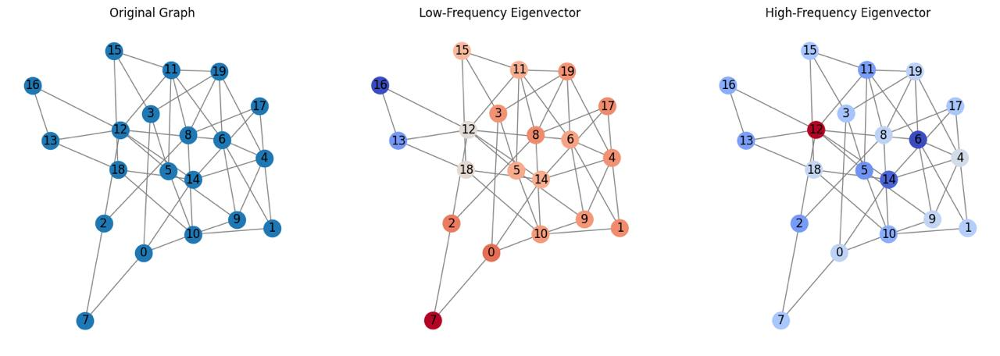
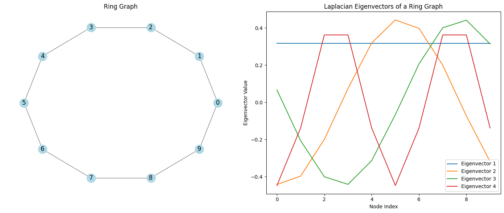
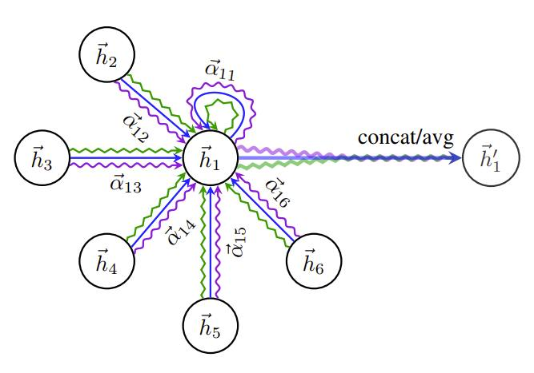
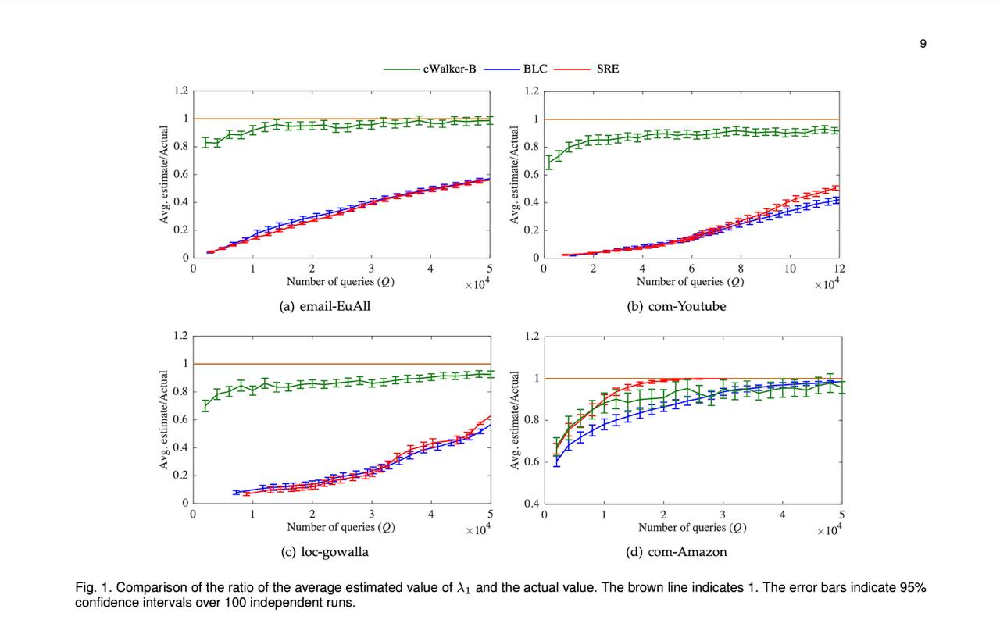
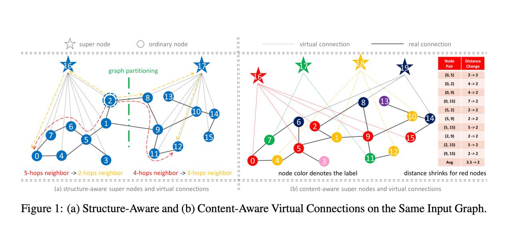

# Intuition Behind Using Laplacian Eigenvectors

### Frequencies in a Graph

Think of eigenvectors of the Laplacian matrix as frequency modes on the graph. If you’ve encountered Fourier analysis, you know how sine and cosine waves represent different frequencies in continuous signals. Similarly, eigenvectors of $L$ represent frequency components for discrete signals on the graph.

- **Low-Frequency Modes**: The eigenvectors associated with the smallest eigenvalues of $L$ vary smoothly across the graph. Imagine a graph with two connected clusters — low-frequency eigenvectors will have similar values within each cluster, highlighting global relationships.
- **High-Frequency Modes**: Eigenvectors associated with larger eigenvalues oscillate rapidly, capturing finer, more localized details of the graph.

### Why Does This Matter?

Graphs often represent data with both **local** (neighborhood) and **global** (overall structure) relationships. For example:
- In a social network graph, local relationships capture connections between friends, while global relationships capture community structures.
- In molecular graphs, local relationships detail chemical bonds, while global structures define molecular properties.

Laplacian eigenvectors provide a **multi-scale representation** of the graph, from broad structures (low-frequency) to fine-grained details (high-frequency). This property makes them crucial for tasks like clustering, node embedding, and graph neural networks (GNNs).



---

## Comparison to Positional Encoding in NLP

Graphs may seem unrelated to sequences in NLP (like sentences or time-series data), but they share a surprising conceptual similarity when it comes to encoding positional information.

### Sine and Cosine Positional Encoding in NLP

In NLP, positional encoding ensures that models like Transformers understand the order of tokens in a sequence. The encoding is often done using sine and cosine functions. These functions provide a **continuous, periodic representation** of position that is globally smooth and fixed across all sequences.

### Laplacian Eigenvector Positional Encoding

In contrast, graphs do not have a natural "order" like sequences. Instead, their structure is defined by the connections between nodes. This irregularity makes positional encoding more challenging.

Laplacian eigenvectors solve this by providing a positional encoding tailored to the graph’s topology. Low-frequency eigenvectors give smooth, global encoding across the graph, analogous to sine and cosine functions. High-frequency eigenvectors adaptively capture local details based on the graph's structure.

---

Understanding Laplacian eigenvectors goes beyond technical definitions — they provide a lens for exploring **how information flows through a graph**. At their core, these eigenvectors allow us to break down complex graph structures into interpretable "building blocks."

### Interpreting Eigenvalues and Eigenvectors

Let’s revisit the Laplacian matrix $L=D−AL = D - A$, where $D$ is the degree matrix and $A$ is the adjacency matrix:

- **Eigenvalues**: Represent the "energy" required to transition between connected nodes.
- **Eigenvectors**: Define the "directions" or "patterns" of this energy transition.

Let’s visualize eigenvector patterns on a simple graph.

### Example: Ring Graph

Consider a circular graph with 10 nodes:

- The first eigenvector (associated with the smallest eigenvalue) assigns nearly equal values to all nodes, representing a global structure.
- Higher eigenvectors alternate more frequently, resembling sinusoidal waves wrapping around the graph.

Here’s the Python code for generating such visualizations:
```python
import networkx as nx
import numpy as np
import matplotlib.pyplot as plt

# Create a circular graph
G = nx.cycle_graph(10)

# Compute the Laplacian and its eigenvectors
L = nx.laplacian_matrix(G).toarray()
eigenvalues, eigenvectors = np.linalg.eigh(L)

# Plot the graph and eigenvectors side by side
fig, ax = plt.subplots(1, 2, figsize=(14, 6))

# Plot the graph
pos = nx.circular_layout(G)  # Position nodes in a circle
nx.draw(G, pos, with_labels=True, node_color='lightblue', edge_color='gray', ax=ax[0])
ax[0].set_title("Ring Graph")

# Plot eigenvectors
for i in range(4):  # Plot the first 4 eigenvectors
    ax[1].plot(eigenvectors[:, i], label=f'Eigenvector {i+1}')
ax[1].set_title("Laplacian Eigenvectors of a Ring Graph")
ax[1].set_xlabel("Node Index")
ax[1].set_ylabel("Eigenvector Value")
ax[1].legend()

plt.tight_layout()
plt.show()
```

**Output:**


---

### A Surprising Connection: Graphs as Sequences

If we take a sentence (or sequence) and represent it as a **graph** where:
- Each word is a node.
- Each word is connected to the next (forming a line graph).

Then the **Laplacian eigenvectors** of this graph will encode positions in the same way as sine and cosine positional encoding. This connection bridges the gap between graph theory and NLP, showing that both frameworks aim to encode structural relationships—whether between tokens in a sequence or nodes in a graph.

For more details you can watch "Recipe for a General, Powerful, Scalable Graph Transformer": https://www.youtube.com/watch?v=DiLSCReBaTg&t=440s

---

## Why is this Useful for Graph Neural Networks (GNNs)?

GNNs rely on encoding node features to process graph data effectively. Laplacian eigenvectors enable this by:
1. Providing a **multi-scale positional encoding** that enhances the expressivity of GNNs.
2. Helping GNNs capture both **global** (e.g., community structures) and **local** (e.g., node neighborhoods) relationships.
3. Acting as a basis for smoothness constraints, enabling robust graph filtering and spectral techniques.

---

### Real-World Analogy


Imagine analyzing a city map:
- Low-frequency eigenvectors represent broad zones (residential, commercial, industrial).
- High-frequency eigenvectors detail specific streets and intersections.

Both perspectives are critical for understanding the city's layout, just as they are for graphs in computational tasks.

---

## Are there any other ways of positional encoding?

While Laplacian eigenvectors are a powerful tool, they aren’t the only way to encode positional information in graphs. Let’s compare and contrast with other methods.

### Graph Wavelet Transform

Wavelets provide a multi-resolution view of a graph, similar to eigenvectors, but they are **localized** in both the graph and spectral domains. This property makes wavelets particularly useful for capturing local variations without losing sight of global structures.

#### Key Differences

|**Feature**|**Laplacian Eigenvectors**|**Graph Wavelets**|
|---|---|---|
|Basis Type|Global|Localized|
|Smoothness vs. Detail|Balances both via eigenvalues|Adapts to specific graph regions|
|Use Case|Clustering, community detection|Node classification, signal denoising|

You can read more about graph waveletes here: https://arxiv.org/abs/0912.3848

---

# Challenges and Solutions in Scaling Graph Transformers

## 1. Attention Complexity: $O(n^2)$

The **self-attention mechanism**, central to the Transformer architecture, computes pairwise attention scores for every combination of nodes. For a graph with $n$ nodes, this results in $O(n^2)$ complexity. While feasible for small graphs, this becomes prohibitive for larger graphs with thousands or millions of nodes. 

### Why is this a problem?
In large graphs, the quadratic growth in computations leads to:
- **Excessive memory usage**: Each pairwise computation requires storage of intermediate values.
- **Slower processing**: Training and inference times become impractical as graph sizes increase.

---

## Suggested Solution: Local Neighborhood Attention

A promising solution is to localize the attention mechanism, restricting computations to a node’s **immediate neighbors** rather than all nodes in the graph.

---

### Local Neighborhood Attention in Graph Attention Networks (GATs)

The **Graph Attention Network (GAT)** is a pioneering architecture that incorporates attention in a scalable way. Here’s how it works:

#### Mechanism
- **Sparse Attention**: Instead of computing attention scores for all pairs of nodes, GATs only compute scores for a node and its **direct neighbors** (nodes connected by an edge).
- **Feature Aggregation**: Each node aggregates information from its neighbors, weighted by the attention scores. Mathematically:
  $$
  h_i' = \sigma \left( \sum_{j \in \mathcal{N}(i)} \alpha_{ij} W h_j \right)
  $$
  - $h_i'$: Updated feature for node $i$
  - $\mathcal{N}(i)$: Set of neighbors for node $i$
  - $\alpha_{ij}$: Attention weight between node $i$ and $j$
  - $W$: Learnable weight matrix
  - $\sigma$: Activation function

#### Efficiency
- **Computational Complexity**: The localized approach reduces complexity from $O(n^2)$ to $O(n|E|)$, where $|E|$ is the number of edges. This is much more practical for sparse graphs where $|E| \ll n^2$.
- **Focus on Relevant Connections**: By attending only to immediate neighbors, the model concentrates on the most relevant parts of the graph.

---

**Illustration of Local Neighborhood Attention in GATs:**


Imagine a social network graph:
- For a person (node), the GAT only attends to their immediate friends (neighbors), ignoring distant connections.
- Each connection’s importance (attention weight) is learned during training, highlighting the most influential relationships.

---
## 2. Eigenvector Computation for Large Matrices

### The Problem

Laplacian eigenvectors are a critical component of positional encoding in Graph Transformers, capturing multi-scale structural information about the graph. However, computing the eigenvectors for large graphs is computationally expensive and memory-intensive.

#### Why is Computing Eigenvectors Hard?

1. **Complexity**: The computational cost of eigenvector computation is $O(n^3)$ for a graph with $n$ nodes, which is infeasible for very large graphs.
2. **Memory Constraints**: Large matrices require significant memory, often exceeding the capacity of standard computational resources.

### Current Approaches to Eigenvector Computation

#### Small Graphs
For small graphs, libraries like **NumPy** use efficient algorithms such as the **QR algorithm** or **Divide-and-Conquer methods** to compute eigenvectors. These methods solve the characteristic equation $Av = \lambda v$, where $A$ is the matrix, $\lambda$ is an eigenvalue, and $v$ is the corresponding eigenvector.

#### Large Graphs
For large graphs, approximate methods are more practical. These include:
- **Truncated Eigen Decomposition**: Computes only the top $k$ eigenvectors using iterative methods like **Lanczos algorithm** or **Power iteration**.
- **Graph Sampling**: Divides the graph into smaller subgraphs and computes eigenvectors locally.
- **Spectral Embedding Approximations**: Leverages methods like random projections or sparse approximations to estimate eigenvectors.


**Closed Walk Sampler: An Efficient Method for Estimating Eigenvalues of Large Graphs. Source: [arXiv:1805.07448](https://arxiv.org/pdf/1805.07448)**

---

## 3. Scaling to Massive Graphs: Innovations in Architecture

Graph Transformers face inherent limitations when processing massive graphs (e.g., with millions of nodes). Recent research has introduced **novel architectures** that address these scalability issues.

### NAGphormer and VCR-Graphormer

#### The Approach
Both **NAGphormer** and **VCR-Graphormer** address scalability by breaking down the graph into manageable subgraphs:
- Each node’s neighborhood is represented as a **sequence**, capturing local structural information.
- These sequences are processed by a **Transformer** to model dependencies within the localized context.

#### Advantages
- **Localized Attention**: Focuses on smaller, relevant subgraphs, reducing the computational burden.
- **Scalability**: Handles massive graphs efficiently by avoiding the need to process the entire graph at once.
- **Preservation of Local Structure**: Encodes important local features while still allowing aggregation of global information over multiple layers.


Subgraph Decomposition and Processing Pipeline in NAGphormer and VCR-Graphormer.
Source: [arXiv:2403.16030](https://arxiv.org/abs/2403.16030)


#### Limitations
These approaches, while promising, may lose some global context if the subgraphs are too small or disconnected. To counter this, researchers are exploring hierarchical models that combine local and global information more effectively.

---

### The Role of Active Research

Both NAGphormer and VCR-Graphormer are part of a rapidly evolving field. With one published in 2023 and the other just months ago, they represent cutting-edge solutions to long-standing challenges in graph processing. Research under experts like **Uri Shaham** https://u.cs.biu.ac.il/~shahamu/ continues to push the boundaries, aiming to develop even more scalable and efficient methods.

---

## Looking Ahead

Graph Transformers hold immense potential for applications across domains, from social network analysis to molecular graph processing. However, their scalability to massive graphs remains a bottleneck. By integrating:
- **Localized attention mechanisms**,
- **Efficient eigenvector approximations**, and
- **Subgraph-based architectures**,

we can design models that retain the expressive power of Transformers while scaling to real-world graph sizes.
